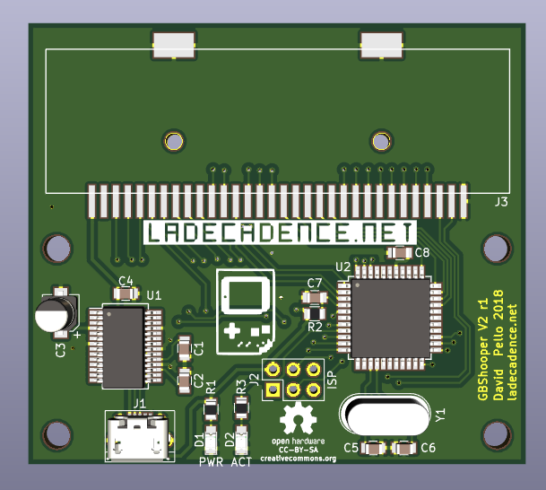

# GBShooper

Open source hardware GameBoy™ FlashCart Reader/Programmer

This flashcart programmer, uses the firmware at (https://github.com/ladecadence/GBShooper-Firmware)

For building it, you'll need an Atmega8515L-16AI (TQFP, -8AI also ok), a ft232rl (soic28), a 6MHz xtal, and some passives, like capacitors, resistors and LEDs.

Full Bill of Materials in the BOM file (LibreOffice and PDF).

You'll also need a micro-usb "B" connector, and a GameBoy Cartridge connector. This version uses SMD replacement connectors for the Nintendo DS, you can find them online in Aliexpress or the like.

You can use this programmer to dump original cartridges, and flash DIY flashcarts and some other flashcarts based on DIY designs and nintendo mappers (or clones).
PC-Side software is being developed right now and will also be published at ladecadence.net github.

